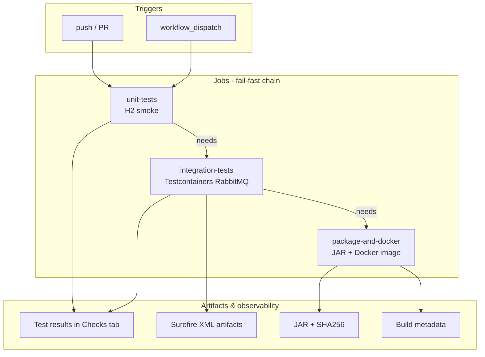

# WorkHub — CI/CD Architecture & Operations Guide

Enterprise GitHub Actions pipeline for the WorkHub Spring Boot multi-tenant SaaS backend.

**Workflow file:** [`.github/workflows/ci.yml`](workflows/ci.yml)

---

## CI architecture



### Design principles

| Principle | Implementation |
|-----------|----------------|
| **Fail fast** | `needs:` chain — integration runs only if unit passes; Docker build only if integration passes |
| **No silent skips** | `verify-no-skipped-tests.py` + `--min-tests 30` on integration |
| **Testcontainers parity** | Docker verified + RabbitMQ image pre-pulled (`rabbitmq:3.13-management`) |
| **Reproducible builds** | Pinned Java 17 Temurin, `-B -ntp` Maven, Buildx GHA cache scoped by branch |
| **Observability** | `upload-test-results`, `GITHUB_STEP_SUMMARY`, Surefire artifacts |
| **Concurrency** | Cancel superseded runs on same PR/branch |

---

## Pipeline stages

### Stage 1 — Unit tests (`unit-tests`)

| Step | Purpose |
|------|---------|
| Checkout | Source at commit SHA |
| Setup Java 17 + Maven cache | Temurin JDK, dependency cache |
| `mvn test` (excludes `*IntegrationTest`) | Fast compile + `WorkHubApplicationTests` (H2) |
| Verify Surefire | ≥1 test, 0 skips/failures |
| Upload test results | GitHub Checks UI |
| Upload artifacts | `surefire-unit-*` (7 days) |

**No Docker required.** Catches compilation and basic Spring context issues in ~1–2 minutes.

### Stage 2 — Integration tests (`integration-tests`)

| Step | Purpose |
|------|---------|
| Docker verify | `docker version`, `hello-world` |
| Pre-pull `rabbitmq:3.13-management` | Same image as `Phase2EnterpriseIntegrationTest` — reduces flakes |
| `mvn test` (integration only) | 6 integration classes + Phase2 (RabbitMQ Testcontainer) |
| Retry (max 2) | Transient Testcontainers/Docker flakes |
| Verify Surefire | **≥30 tests**, **0 skips** |
| Upload test results + artifacts | 14-day retention for forensics |

**RabbitMQ/Testcontainers:** `Phase2EnterpriseIntegrationTest` starts `RabbitMQContainer`, wires Spring via `@DynamicPropertySource`, and exercises async report generation, idempotency, RBAC, and actuator endpoints.

### Stage 3 — Package & Docker (`package-and-docker`)

| Step | Purpose |
|------|---------|
| `mvn -DskipTests clean package` | Executable fat JAR |
| SHA256 checksum | Reproducibility audit trail |
| Docker Buildx + GHA cache | Multi-stage `Dockerfile` build |
| Image tags | `workhub:ci-<sha>`, `workhub:ci-latest` |
| Metadata artifact | Image ID + JAR hash (30 days) |

Tests are **not** re-run in this job — build is blocked unless Stage 2 passed.

---

## Environment variables (CI)

| Variable | Value | Purpose |
|----------|-------|---------|
| `TESTCONTAINERS_DOCKER_SOCKET_OVERRIDE` | `/var/run/docker.sock` | GHA runner Docker socket |
| `TESTCONTAINERS_RYUK_DISABLED` | `false` | Container cleanup between tests |
| `CI_MIN_INTEGRATION_TESTS` | `30` | Fail if Testcontainers tests skipped |
| `RABBITMQ_TEST_IMAGE` | `rabbitmq:3.13-management` | Pre-pull + test alignment |

---

## Local parity

```bash
# Unit (no Docker)
mvn test "-Dtest=!*IntegrationTest,!Phase2EnterpriseIntegrationTest"
python .github/scripts/verify-no-skipped-tests.py --label unit --min-tests 1

# Integration (Docker required)
docker pull rabbitmq:3.13-management
mvn test "-Dtest=*IntegrationTest,Phase2EnterpriseIntegrationTest"
python .github/scripts/verify-no-skipped-tests.py --label integration --min-tests 30

# Package + Docker (after tests)
mvn -DskipTests clean package
docker build -t workhub:local .
```

---

## Troubleshooting

### Integration job: `Skipped tests are not allowed`

**Cause:** Docker unavailable or `@Testcontainers(disabledWithoutDocker = true)` skipped `Phase2EnterpriseIntegrationTest`.

**Fix:**

- Run on `ubuntu-latest` (Docker pre-installed).
- Verify `docker info` in job logs.
- Do not set `TESTCONTAINERS_CHECKS_DISABLE=true`.
- Ensure `CI_MIN_INTEGRATION_TESTS` tests actually ran (check Surefire artifact).

### Integration job: `Expected at least 30 tests, but only N ran`

**Cause:** Maven `-Dtest` filter typo or tests not discovered.

**Fix:**

- Confirm class names end with `IntegrationTest` or include `Phase2EnterpriseIntegrationTest`.
- Run locally with same `-Dtest` expression.
- Lower `CI_MIN_INTEGRATION_TESTS` only if you intentionally removed tests (not recommended).

### RabbitMQ / Testcontainers timeout

**Symptoms:** `ContainerLaunchException`, `Connection refused`, job timeout.

**Fix:**

- Pre-pull: `docker pull rabbitmq:3.13-management` (CI already does this).
- Retry step runs Maven twice on error.
- Increase `timeout-minutes` on integration job (currently 30).
- Check Ryuk not blocked: `TESTCONTAINERS_RYUK_DISABLED=false`.

### Unit tests pass, integration fails on Phase2 only

**Symptoms:** Async/RabbitMQ assertion failures, Awaitility timeout.

**Fix:**

- Review `Phase2EnterpriseIntegrationTest` logs in Surefire artifact.
- Confirm `spring.rabbitmq.listener.simple.auto-startup=true` in `@DynamicPropertySource`.
- Run single class: `mvn test -Dtest=Phase2EnterpriseIntegrationTest`.

### Docker build fails after tests pass

**Symptoms:** Maven OK, Buildx failure.

**Fix:**

- Run `docker build -t workhub:local .` locally.
- Check Dockerfile multi-stage network for dependency download.
- Clear GHA cache: re-run with empty cache or change `scope=workhub-*` in workflow.

### `upload-test-results` permission error

**Cause:** Missing `checks: write`.

**Fix:** Workflow sets `permissions.checks: write` — do not override at org level to `read-only` for this repo.

### Maven cache stale / wrong dependencies

**Fix:**

```bash
# Bump cache key by changing pom.xml or clear cache in GHA UI
mvn -U clean test
```

---

## Common CI failure explanations

| Failure message | Meaning | Typical fix |
|-----------------|---------|-------------|
| `BUILD FAILURE` (Maven) | Compile or test assertion failed | Read Surefire report in artifact or Checks tab |
| `No Surefire reports found` | `mvn test` did not run or wrong working directory | Ensure `target/surefire-reports` exists |
| `Process completed with exit code 1` (verify script) | Skips, failures, or below min test count | See script stdout in log |
| `cancelled` | Newer commit on same PR triggered concurrency | Expected — re-run latest commit |
| `The job was not started because...` | Upstream job failed (`needs:`) | Fix unit or integration job first |
| `docker: not found` | Wrong runner image | Use `ubuntu-latest` |
| `hello-world` pull failed | Docker daemon not running | Re-run job; report to GitHub if persistent |
| Testcontainers Ryuk errors | Port/bind conflicts on self-hosted runners | Use GitHub-hosted runners or configure Ryuk |

---

## Artifact reference

| Artifact | Job | Retention | Contents |
|----------|-----|-----------|----------|
| `surefire-unit-*` | unit | 7d | Unit Surefire XML |
| `surefire-integration-*` | integration | 14d | Integration Surefire XML |
| `workhub-jar-<sha>` | package | 30d | Fat JAR + SHA256 |
| `ci-build-metadata-<sha>` | package | 30d | Image ID, JAR hash |

---

## Enterprise extensions (future)

- Push image to GHCR / ECR on `main` only
- OWASP dependency-check or Snyk scan job
- Deploy to staging via `kubectl` / Terraform after green `main`
- Required status checks: all three jobs on protected branches

---

## Related documentation

- [DOCKER.md](../DOCKER.md) — local Docker Compose stack
- [TESTPLAN.md](../TESTPLAN.md) — requirement-to-test mapping
- [k8s/base](../k8s/base) — Kubernetes manifests (deploy after CI)
