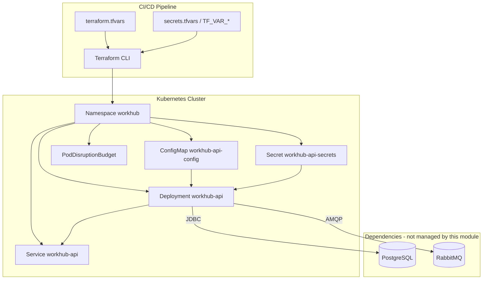
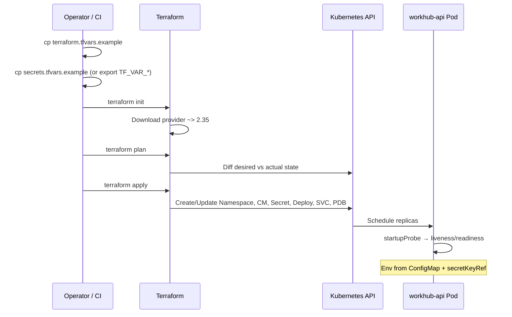

# WorkHub Platform — Terraform Infrastructure

Enterprise Infrastructure-as-Code (IaC) for deploying the **WorkHub multi-tenant SaaS API** to Kubernetes. This stack uses the [HashiCorp Kubernetes provider](https://registry.terraform.io/providers/hashicorp/kubernetes/latest/docs) and aligns with the declarative manifests in [`../k8s/base`](../k8s/base).

---

## Table of contents

1. [Architecture overview](#architecture-overview)
2. [Infrastructure flow](#infrastructure-flow)
3. [Repository structure](#repository-structure)
4. [Prerequisites](#prerequisites)
5. [Init / plan / apply](#init--plan--apply)
6. [Configuration model](#configuration-model)
7. [Outputs](#outputs)
8. [Audit summary](#audit-summary)
9. [Troubleshooting](#troubleshooting)
10. [Enterprise IaC principles](#enterprise-iac-principles)
11. [Coexistence with Kustomize](#coexistence-with-kustomize)

---

## Architecture overview

WorkHub separates **stateless API compute** (this Terraform module) from **data services** (PostgreSQL, RabbitMQ), which are typically deployed via Docker Compose locally (`docker-compose.yml`) or cluster operators / managed cloud services in production.



### Design goals

| Goal | Implementation |
|------|----------------|
| **Reproducibility** | Pinned Terraform (`>= 1.5.0`) and provider (`kubernetes ~> 2.35`) |
| **No secrets in Git** | Sensitive vars + `secrets.tfvars` gitignored; ConfigMap excludes credentials |
| **K8s parity** | `align_k8s_manifests` uses same names as `k8s/base` |
| **Safe deploys** | Rolling update `maxUnavailable: 0`, Actuator probes, PDB |
| **Scalability** | Environment roots (`dev`, `staging`, `production`) + reusable module |

---

## Infrastructure flow

End-to-end sequence from developer workstation to running pods:



**Per-resource flow:**

1. **Namespace** — isolates WorkHub workloads; Pod Security Standards `restricted`.
2. **ConfigMap** — non-sensitive Spring/env config (JDBC URL without password, RabbitMQ host, JVM).
3. **Secret** — credentials only; base64-encoded at rest in etcd (enable encryption at rest in prod clusters).
4. **Deployment** — pulls image, mounts env, probes `/actuator/health/*`.
5. **Service** — stable ClusterIP DNS for Ingress or mesh.
6. **PDB** — ensures minimum pods during node drains.

---

## Repository structure

```
terraform/
├── README.md                      # This document
├── Makefile                       # init / plan / apply shortcuts
├── versions.tf                    # Terraform & provider pins
├── providers.tf                   # Kubernetes provider
├── main.tf                        # Root module call
├── variables.tf                   # Root inputs + validation
├── outputs.tf                     # Root outputs (no secret values)
├── terraform.tfvars.example       # Non-secret template
├── secrets.tfvars.example         # Sensitive template (REPLACE_ME only)
├── .gitignore
├── modules/workhub-platform/      # Reusable implementation
│   ├── namespace.tf
│   ├── config.tf                  # SA, ConfigMap, Secret
│   ├── deployment.tf
│   ├── service.tf
│   ├── pdb.tf
│   ├── locals.tf                  # k8s alignment + computed JDBC URL
│   ├── variables.tf
│   └── outputs.tf
└── environments/                  # Scalable environment entry points
    ├── dev/
    ├── staging/
    └── production/
```

---

## Prerequisites

| Requirement | Version / notes |
|-------------|-----------------|
| Terraform | `>= 1.5.0` |
| kubectl | Configured for target cluster |
| Kubernetes cluster | 1.25+ recommended |
| Container image | Built from project `Dockerfile` and pushed to registry |
| PostgreSQL & RabbitMQ | Reachable from cluster (in-cluster DNS or managed endpoints) |

**Local cluster options:** minikube, kind, Docker Desktop Kubernetes, or cloud EKS/GKE/AKS.

---

## Init / plan / apply

### Option A — Environment root (recommended)

Use separate state per environment under `environments/<env>/`.

```bash
cd terraform/environments/dev

# 1. Non-secret config
cp terraform.tfvars.example terraform.tfvars
# Edit: image_repository, image_tag

# 2. Secrets (gitignored)
cp ../../secrets.tfvars.example secrets.tfvars
# Edit with dev credentials OR use TF_VAR_* exports instead

# 3. Initialize providers and backend
terraform init

# 4. Preview changes
terraform plan \
  -var-file=terraform.tfvars \
  -var-file=secrets.tfvars

# 5. Apply
terraform apply \
  -var-file=terraform.tfvars \
  -var-file=secrets.tfvars

# 6. Verify
terraform output
kubectl -n workhub rollout status deployment/workhub-api
kubectl -n workhub get pods,svc
```

**Production:**

```bash
cd terraform/environments/production
cp terraform.tfvars.example terraform.tfvars
# Inject secrets via CI: TF_VAR_* from vault (do not commit secrets.tfvars)
terraform init
terraform plan -var-file=terraform.tfvars
terraform apply -var-file=terraform.tfvars
```

### Option B — Root module

```bash
cd terraform
cp terraform.tfvars.example terraform.tfvars
export TF_VAR_database_username="postgres"
export TF_VAR_database_password="<secret>"
export TF_VAR_jwt_secret="$(openssl rand -base64 32)"
export TF_VAR_rabbitmq_username="workhub"
export TF_VAR_rabbitmq_password="<secret>"

terraform init
terraform plan
terraform apply
```

### Option C — Makefile

```bash
cd terraform
# Requires: environments/dev/terraform.tfvars + secrets.tfvars
make -C terraform init ENV=dev
make -C terraform plan ENV=dev
make -C terraform apply ENV=dev
make -C terraform verify ENV=dev
```

### Injecting secrets (no hardcoding)

| Method | Use case |
|--------|----------|
| `TF_VAR_database_password` | CI/CD, local export |
| `-var-file=secrets.tfvars` | Local dev (file gitignored) |
| Terraform Cloud / Enterprise | Workspace variables (sensitive) |
| External Secrets + K8s | GitOps hybrid (Secret not in TF) |

**Never** commit `terraform.tfvars` or `secrets.tfvars` with real values.

---

## Configuration model

### ConfigMap (non-sensitive)

Mirrors `k8s/base/configmap.yaml`:

- `SPRING_PROFILES_ACTIVE`, `DATABASE_URL` (no password), `RABBITMQ_HOST`, `WORKHUB_RABBIT_*`, `JAVA_OPTS`, logging levels.

Auto-computed when omitted:

```text
jdbc:postgresql://postgres.<namespace>.svc.cluster.local:5432/workhub
rabbitmq.<namespace>.svc.cluster.local
```

### Secret (sensitive)

| Key | Application binding |
|-----|---------------------|
| `DATABASE_USERNAME` | `secretKeyRef` |
| `DATABASE_PASSWORD` | `secretKeyRef` |
| `JWT_SECRET` | `secretKeyRef` (min 32 chars, validated) |
| `RABBITMQ_USERNAME` | `secretKeyRef` |
| `RABBITMQ_PASSWORD` | `secretKeyRef` |

### Key variables

| Variable | Default | Description |
|----------|---------|-------------|
| `environment` | required | `dev`, `staging`, `production` |
| `align_k8s_manifests` | `true` | Use `k8s/` resource names |
| `manage_namespace` | `true` | Create namespace or use existing |
| `replicas` | `2` | API pod count (1–50) |
| `image_repository` | required | Container registry path |
| `database_url` | computed | Override JDBC URL |
| `probes` | see module | Actuator probe tuning |

---

## Outputs

| Output | Sensitive | Description |
|--------|-----------|-------------|
| `namespace` | no | Target namespace |
| `service_cluster_dns` | no | e.g. `workhub-api.workhub.svc.cluster.local` |
| `deployment_name` | no | Deployment name |
| `config_map_name` | no | ConfigMap name |
| `secret_name` | **yes** | Secret name only |
| `secret_keys` | no | Key names, never values |
| `database_url_resolved` | no | JDBC URL without password |
| `k8s_manifest_alignment` | no | TF ↔ K8s name mapping |
| `kubectl_commands` | no | Post-deploy helpers |

---

## Audit summary

Audit performed against enterprise DevOps and academic rigor criteria.

| Criterion | Status | Evidence |
|-----------|--------|----------|
| **Infrastructure reproducibility** | Pass | Pinned versions; module + env roots; deterministic resource names |
| **No hardcoded secrets** | Pass | No credentials in `.tf` or committed tfvars; `secrets.tfvars` gitignored |
| **Proper variable usage** | Pass | Validation on env, replicas, JWT length, non-empty secrets, PDB ≤ replicas |
| **Clean outputs** | Pass | Secret values never exported; `secret_name` marked sensitive |
| **Reusable architecture** | Pass | `modules/workhub-platform` consumed by dev/staging/production |
| **K8s manifest alignment** | Pass | `align_k8s_manifests`, documented mapping table |
| **Separation ConfigMap/Secret** | Pass | `env_from` vs `secretKeyRef` pattern |
| **Operational safety** | Pass | Probes, PDB, rolling update, `progress_deadline_seconds` |

**Hardening applied in this pass:**

- Non-empty validation on all credential variables
- `pdb_min_available <= replicas` validation + deployment precondition
- `secrets.tfvars.example` + expanded `.gitignore`
- Staging environment root
- `Makefile` for repeatable workflows
- This README (architecture, flow, troubleshooting, IaC principles)

---

## Troubleshooting

### `terraform init` fails

| Symptom | Cause | Fix |
|---------|-------|-----|
| Provider download error | No network / proxy | Check proxy; run `terraform init -upgrade` |
| Backend access denied | S3/GCS backend misconfigured | Verify credentials; test with local backend first |

### `terraform plan` — missing variables

```
Error: No value for required variable
```

Set all sensitive variables via `TF_VAR_*` or `-var-file=secrets.tfvars`. Copy `secrets.tfvars.example` → `secrets.tfvars`.

### `jwt_secret` validation failed

JWT HS256 requires **≥ 32 characters**:

```bash
export TF_VAR_jwt_secret="$(openssl rand -base64 32)"
```

### `pdb_min_available` validation failed

Ensure `pdb_min_available <= replicas` (e.g. replicas=2 → pdb_min_available=1 or 2).

### Kubernetes provider authentication

```
Error: Invalid credentials / Unauthorized
```

```bash
kubectl cluster-info
kubectl get ns
# Set KUBECONFIG or kubeconfig_path / kubeconfig_context variables
```

### Pods CrashLoopBackOff after apply

```bash
kubectl -n workhub logs deployment/workhub-api --tail=100
kubectl -n workhub describe pod -l app.kubernetes.io/name=workhub-api
```

| Log pattern | Fix |
|-------------|-----|
| Connection refused `postgres` | Deploy Postgres or patch `database_host` |
| Connection refused `rabbitmq` | Deploy RabbitMQ or patch `rabbitmq_host` |
| Schema validation error | Use `spring_profiles_active=docker` in dev or run migrations before `prod` |
| JWT errors | Ensure `jwt_secret` length ≥ 32 |

### Drift detection

If someone runs `kubectl edit`:

```bash
terraform plan
# Shows diff — run terraform apply to reconcile OR import intentional changes into .tf
```

### Destroy

```bash
terraform destroy -var-file=terraform.tfvars -var-file=secrets.tfvars
```

Removes TF-managed API resources; does not delete cloud RDS or compose volumes.

---

## Enterprise IaC principles

### How Terraform prevents infrastructure drift

Terraform stores **desired state** in code and **actual state** in a state file. Every `plan` compares them. Manual cluster edits appear as drift on the next plan, enabling teams to revert or codify changes. Remote state with locking prevents concurrent conflicting applies.

### Reproducibility benefits

- Same inputs produce the same resource graph in dev, staging, and production.
- Provider version constraints prevent silent behavioral changes.
- Environment-specific tfvars document intentional differences (replicas, resources, probes).

### Why ConfigMaps and Secrets are separated

| | ConfigMap | Secret |
|---|-----------|--------|
| **Data** | Hosts, ports, feature flags | Passwords, tokens |
| **Git** | Safe to template in `terraform.tfvars.example` | Never committed |
| **RBAC** | Broader read for debugging | Restricted |
| **Rotation** | Low risk | High priority, audited |

This matches the Spring Boot model in `application-prod.yml`: `DATABASE_URL` without password; credentials from environment Secret keys.

---

## Coexistence with Kustomize

| Tool | Path | Best for |
|------|------|----------|
| Kustomize | `k8s/` | GitOps PR reviews, kubectl workflows |
| Terraform | `terraform/` | CI pipelines, multi-cloud, state tracking |

**Do not** apply both to the same Deployment without Terraform import. Recommended split:

- **Terraform:** API Deployment, Service, ConfigMap, Secret, PDB, Namespace
- **Kustomize / operators:** Postgres, RabbitMQ, Ingress, NetworkPolicy

If namespace already exists: `manage_namespace = false`.

---

## Related documentation

- [DOCKER.md](../DOCKER.md) — local Docker Compose stack
- [k8s/base](../k8s/base) — equivalent Kubernetes YAML
- [application-prod.yml](../src/main/resources/application-prod.yml) — runtime config contract

---

## Academic / project submission checklist

- [ ] Terraform and kubectl installed; cluster reachable
- [ ] `terraform.tfvars.example` and `secrets.tfvars.example` copied and documented
- [ ] `terraform plan` screenshot or log attached (no secret values visible)
- [ ] `kubectl get pods -n workhub` showing Ready replicas
- [ ] `curl` actuator health via port-forward
- [ ] Brief note on ConfigMap vs Secret separation and drift prevention
